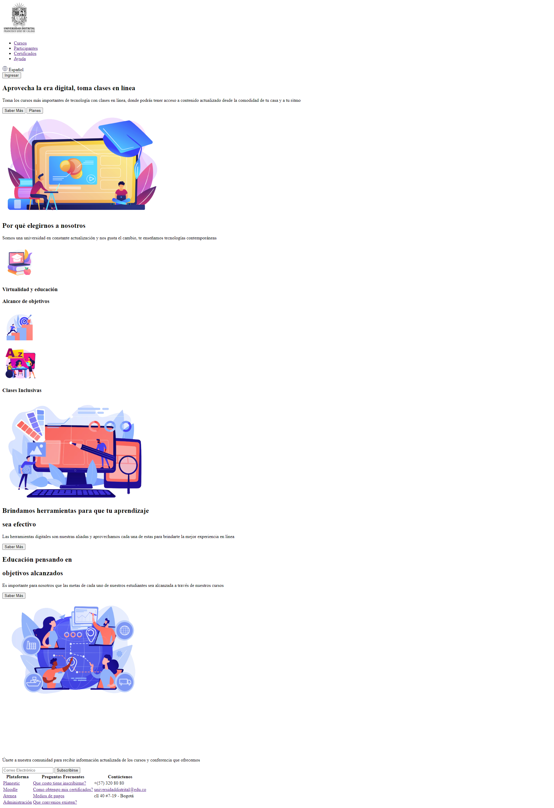
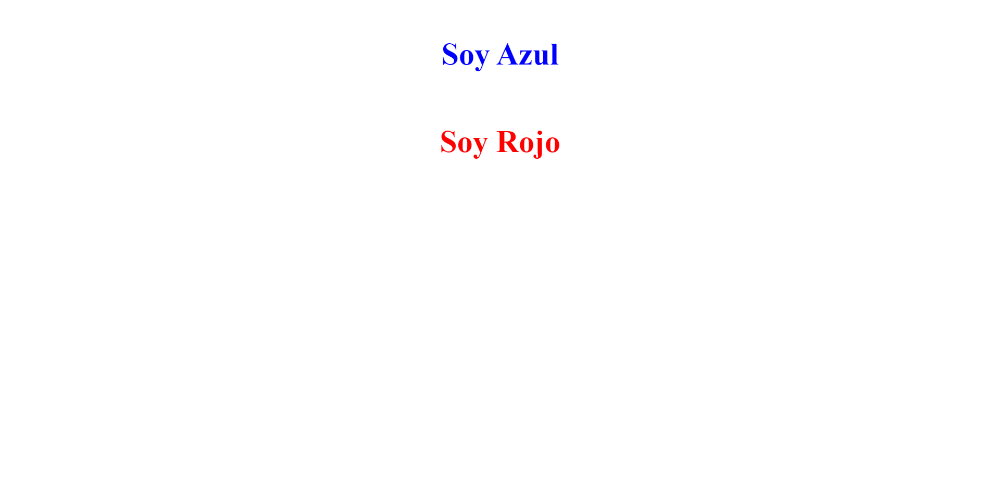
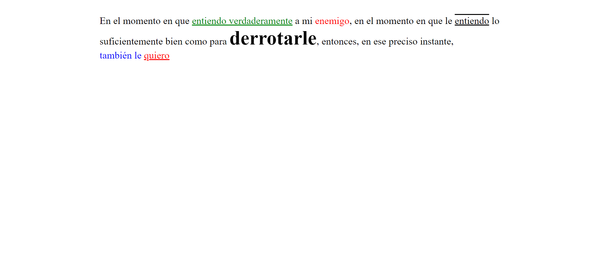
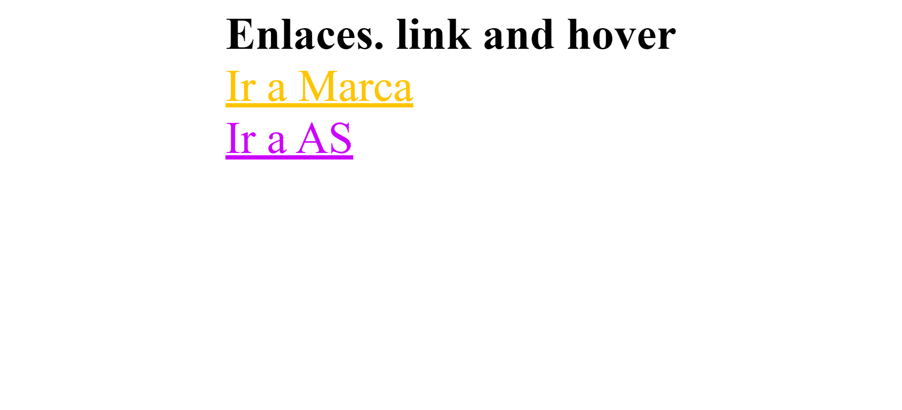
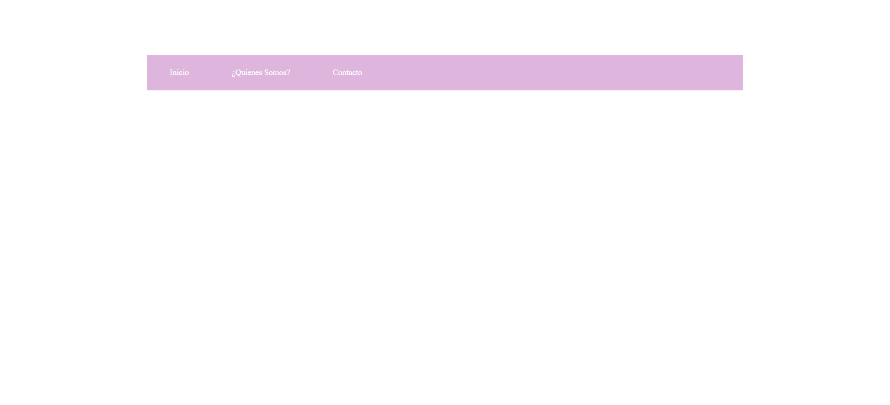
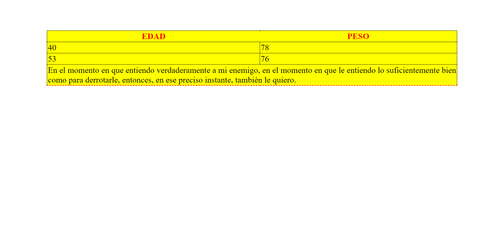

<h1>Taller 9: Cristian Olarte</h1>

<h2>Información</h2>

Curso: Full Stack Básico - Grupo 1

Profesor: Cristian Patiño

<h2>Punto 1: Link de figma</h2>
<a href="https://www.figma.com/file/JkgMEQcYRcqPRaKetImRSB/Cristian-Olarte---Figma-Exercise?type=design&node-id=2%3A248&t=qUot3f8u7vLTSWiG-1">Link de Figma</a>

<a href="https://texxmg.github.io/taller-9-full-stack/">Link página Web</a>

<h2>Punto 2: HTML</h2>

<h2>Punto 3: CSS</h2>

<h2>Punto 4: Títulos</h2>

<h2>Punto 5: Estilos de texto</h2>

<h2>Punto 6: Enlaces</h2>

<h2>Punto 7-8: Navegación</h2>

<h2>Punto 9: Tablas</h2>

